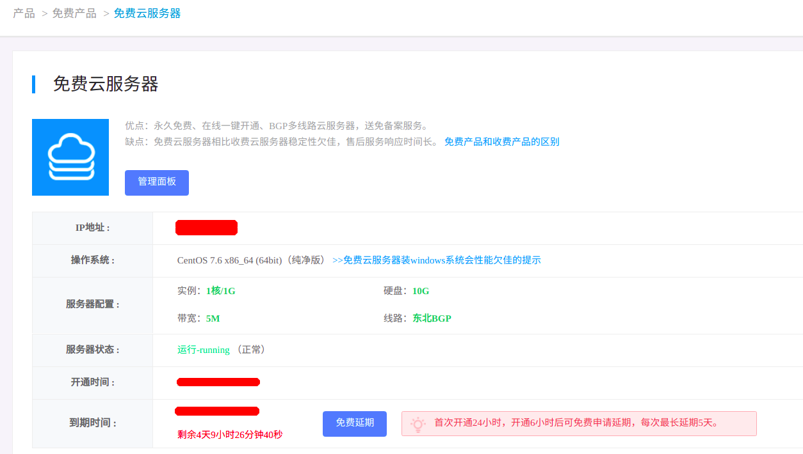

## 一.项目简介


> &emsp;&emsp;实现三丰云的免费云服务器的自动延期。
>
> 一个免费的云服务器，虽然配置不咋地，但它不香吗？
>
> 大约 Many Years 之前三丰云的免费云服务器是不需要延期的，但现在需要了，每五天要手动延期一次，避免麻烦，写了这个自动延期的脚本。
>
> &emsp;&emsp;你可以在三丰云的免费云服务器上运行这个自动化脚本。需要搭建好运行环境。


- 免费服务器配置：




---


## 二.运行环境

> &emsp;&emsp;这里的环境是在 CentOS7 上搭建的，在Ubuntu等其他Linux系统步骤类似，可自行百度安装。
>
> 主要环境：
>
> - CentOS7
>
> - python3
>
> - selenium
>
> - Chrome浏览器及Chrome Driver
>
> 
> 这里仅使用selenium和Chrome来完成评论截图功能。
> 


### 1.安装 python3

> &emsp;&emsp;先直接用 yum 安装看是否可以：`yum -y install python3`。
>
> 当然你还可以搭建python虚拟环境：https://www.bootwiki.com/note/python-virtualenv.html 。
>
> 也可参考 https://www.cnblogs.com/xiujin/p/11477419.html 来编译安装。
>
> 而我更喜欢编译安装：
>
> 注意：`--with-ssl`参数已经失效了，需要你修改 `./Python-3.6.13/setup.py`和 `./Python-3.6.13/Modules/Setup.dist` 这两个文件中 SSL 相关部分的代码后再安装。

- ①[python官网](https://www.python.org/downloads/)下载你需要的源码：

```shell
cd /root
wget https://www.python.org/ftp/python/3.6.13/Python-3.6.13.tgz
```

- ②解压：

```shell
tar -zxvf Python-3.6.13.tgz
```

- ③编译并安装：

```shell
mkdir /usr/local/python3.6
cd Python-3.6.13
./configure --prefix=/usr/local/python3.6 --enable-optimizations --with-ssl
make
make install
```

- ④链接python3与pip3：

```shell
ln -s /usr/local/python3.6/bin/python3 /usr/bin/python3
ln -s /usr/local/python3.6/bin/pip3 /usr/bin/pip3
```

- ⑤验证是否安装成功：

```shell
python3 -V
pip3 -V
```

- ⑥安装完后，给pip换源，提高速度：https://blog.csdn.net/sheqianweilong/article/details/90301922 参考即可。


### 2.安装Chrome浏览器

```shell
wget https://dl.google.com/linux/direct/google-chrome-stable_current_x86_64.rpm
yum -y install google-chrome-stable_current_x86_64.rpm
yum update glib2 -y
```

- 查看版本：

```shell
/opt/google/chrome/google-chrome --version
```


### 3.安装Chrome Driver

- ①查看浏览器版本：`/opt/google/chrome/google-chrome --version`。
- ②在 https://npm.taobao.org/mirrors/chromedriver/ 下载对应版本的 driver。

```shell
wget http://chromedriver.storage.googleapis.com/89.0.4389.23/chromedriver_linux64.zip
```

- ③解压并安装：

```shell
unzip chromedriver_linux64.zip
mv chromedriver /opt/google/chrome/
chmod +x /opt/google/chrome/chromedriver
ln -s /opt/google/chromedriver /usr/bin/chromedriver
```


---


## 三.运行项目


### 1. clone项目

```shell
git clone https://github.com/CRainyDay/auto-delay.git /opt/auto-delay/
```


### 2.安装依赖

```shell
cd /opt/auto-delay/
pip3 install -r requirements.txt
```


### 3.配置文件 userinfo.json

| 键       | 释义                             |
| -------- | -------------------------------- |
| phone    | 三丰云登录手机号                 |
| password | 三丰云登录密码                   |
| cname    | 在【主机评测网】发表评论时的昵称 |
| area     | 在【主机评测网】发表评论时的地区 |


- 注意：这里建议最好设置一下你的 `cname` ，这样方便找到你的评论，只要`cname`唯一，一定能找到你的评论。不设置`cname`的话，使用`area`来寻找你的评论。
- 注意：这里的 `area`，要和你的登录 IP 地址一致。若不知道，可以先随便从【主机评测网】找一个，等运行完脚本后，查看日志即可找到三丰云的登录 IP 地址。


- 如下是我在三丰云免费服务器上的日志（此时 `"area": "辽宁省大连市"`）：


### 4.使用crontab定时任务

- 当在你的服务器上可以正常执行`python3 main.py` 命令时，使用 crontab 来创建定时任务即可。

- 注意：`python3 main.py`默认加载 userinfo.json。

- 使用`crontab -e` 加入定时任务：

```shell
SHELL=/bin/bash
# 同步服务器时间
# 59 5 * * *    ntpdate ntp1.aliyun.com

# 每天06:00删除截图
# 00 6 * * * rm -f /opt/auto-delay/screenshot/*.png
# 每天10:00启动脚本
0 10 * * * /usr/bin/python3 /opt/auto-delay/main.py userinfo.json
# 可以配置多个，建议隔一段时间
# 30 10 * * * /usr/bin/python3 /opt/auto-delay/main.py userinfo1.json
#  0 11 * * * /usr/bin/python3 /opt/auto-delay/main.py userinfo2.json
# 30 11 * * * /usr/bin/python3 /opt/auto-delay/main.py userinfo3.json

```


